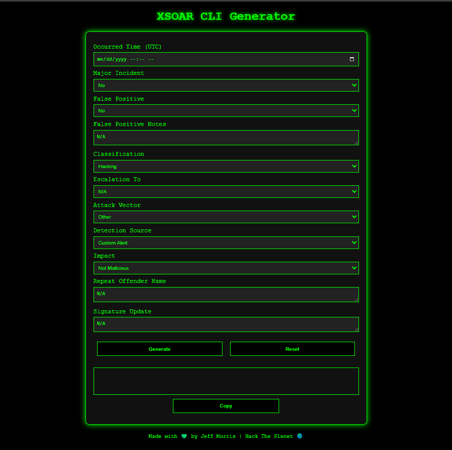

# XSOAR CLI Generator

## Overview
The **XSOAR CLI Generator** is a simple web-based tool designed for **SOC analysts** to quickly generate CLI commands for closing cases in **XSOAR** without manually selecting each field. This tool reduces time spent filling out incident closure fields and ensures accurate data formatting.

This project follows a **hacker-themed dark mode** UI with green text and neon aesthetics, making it both functional and visually appealing.

---

## Features
- **Auto-generates XSOAR CLI commands** with required fields.
- **Dropdowns and input fields** for quick data selection.
- **Auto-detects user's time zone** to format `remediationtime` and `containmenttime` correctly.
- **Ensures all required fields are included**, even if defaulting to "N/A".
- **Dark Mode UI** with neon green styling for hacker aesthetics.
- **Copy Button** to quickly copy the generated CLI command.

---

## How to Use
1. **Open `index.html` in your browser** (no setup required).
2. **Fill in the fields**:
   - `Occurred Time (UTC)`: Select the **original case timestamp** in UTC.
   - **All required dropdowns & input fields**: Select or enter values.
3. **Click "Generate"** to create the XSOAR CLI command.
4. **Copy the command** using the **Copy** button.
5. **Paste it into XSOAR CLI** to set fields.

---

## Time Conversion
- `Occurred Time (UTC)` should be selected **in UTC**.
- **The tool automatically converts it** to the analyst’s **local time zone** for:
  - `remediationtime`
  - `containmenttime`
- If no time is provided, these fields are **excluded from the CLI output**.

---

##  Example Output
After filling out the form and clicking **Generate**, the CLI command will be formatted as follows:

!setIncident majorincident="no" falsepositive="no" falsepositivenotes="N/A" classification="Hacking" escalationto="N/A" attackvector="Other" detectionsource="Custom Alert" impact="Not Malicious" repeatoffendername="N/A" signatureupdate="N/A" workflowstage="Closed" remediationactions="N/A" containmentactions="N/A" remediationtime="2025-03-09T11:19:58-07:00" containmenttime="2025-03-09T11:19:58-07:00"

---

## Customization
- Modify dropdown options inside `index.html` to add or remove case fields.
- Change the UI styling inside the `<style>` section for different themes.
- Adjust JavaScript in `<script>` for additional automation.

---
xsoar-cli-example.png

## Tech Stack
- **HTML + CSS** (Styled for dark mode)
- **JavaScript** (Handles input & time conversions)
- **No external dependencies** (Works as a standalone HTML file)

